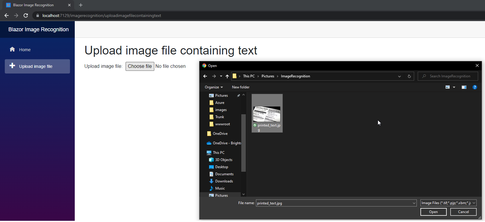
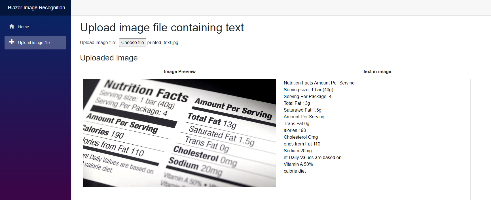

# FRT Project - Blazor Server Image Recognition and Text Extractor App
Project Demo URL - https://blazorimagerecognitionapp.azurewebsites.net/  
 
Project Demo Video URL- https://youtu.be/2DwIo8wiVQw?si=-1AbAoHfXTzud1Iz

## Azure Technologies used
 Azure Services - Azure App Services, Azure Resource Manager  
 Azure AI - Azure Computer Vision, Cognitive Search, Image Recognition
 
 

## Description

Simple Blazor Server app which uses image recognition to identify and extract text printed in an image file uploaded by the user.  The app utilises the recognise printed text in image function in the Azure Computer Vision Cognitive service to identify and extract printed text from an uploaded image file

* GUI frontend project developed using Blazor Server/.Net 6
* Image printed text recognition engine is a class library project developed using .Net 6
   * Communicates with the Azure Computer Vision API v3.2
* Unit Test app which unit tests the image printed text recognition engine.  Uses MS Test .Net 6.
* Deployed Using Azure
# To Deploy

 

 

 

 

# Steps to Use with Screenshots
## Upload image file to analyse

## Image file displayed and printed text from image displayed in text area

